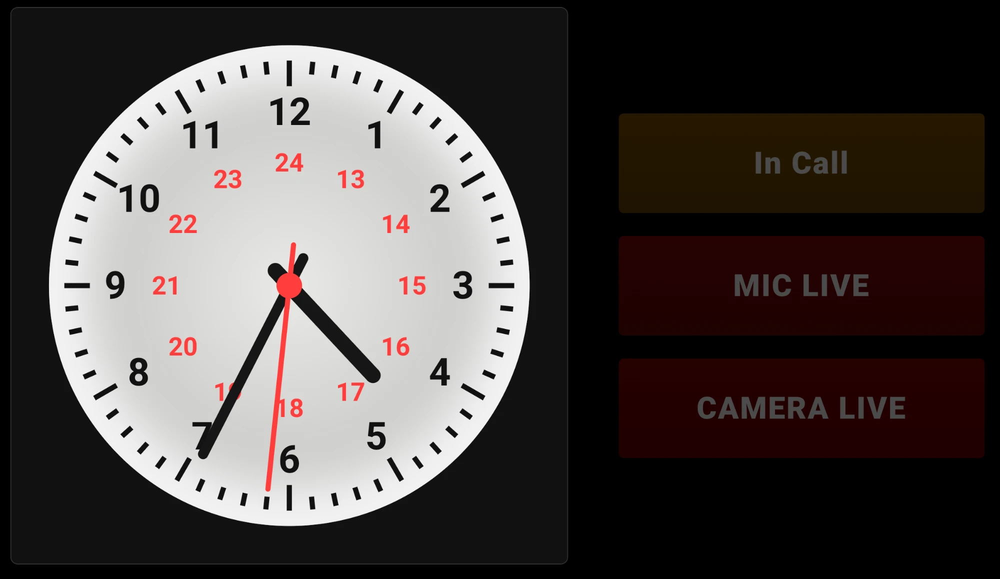
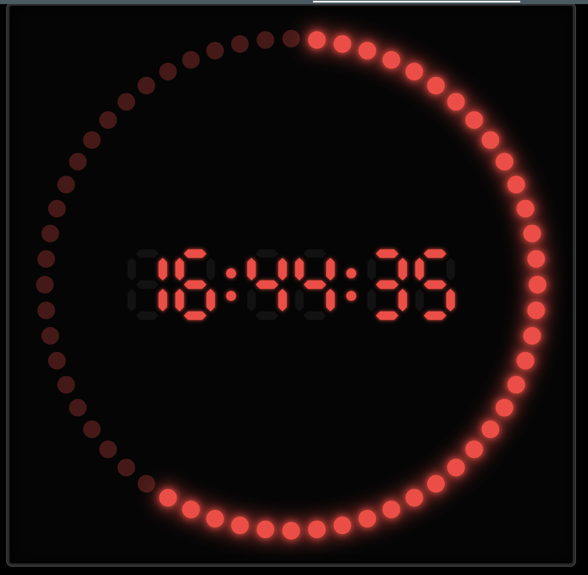
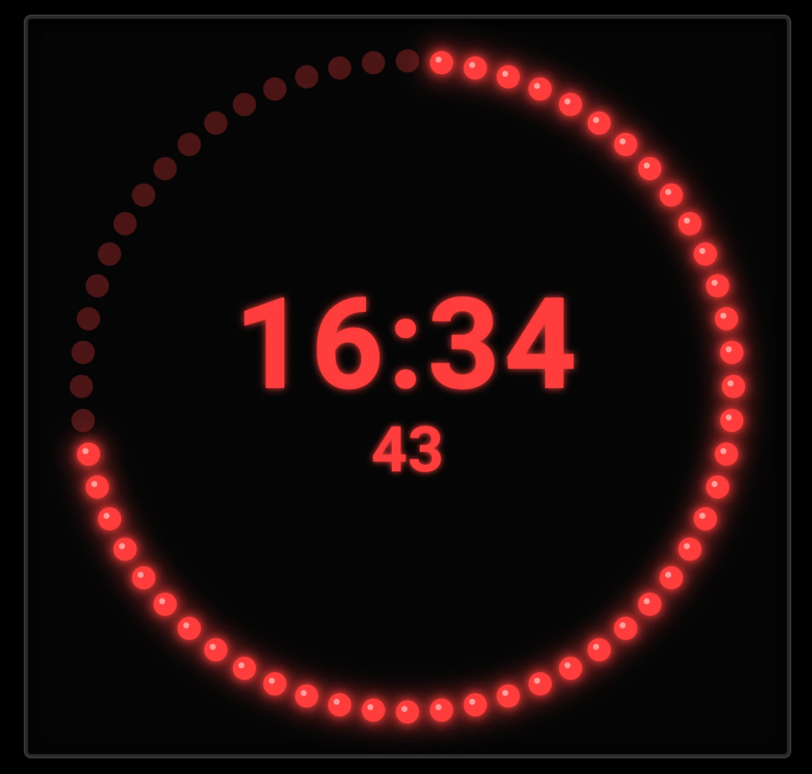
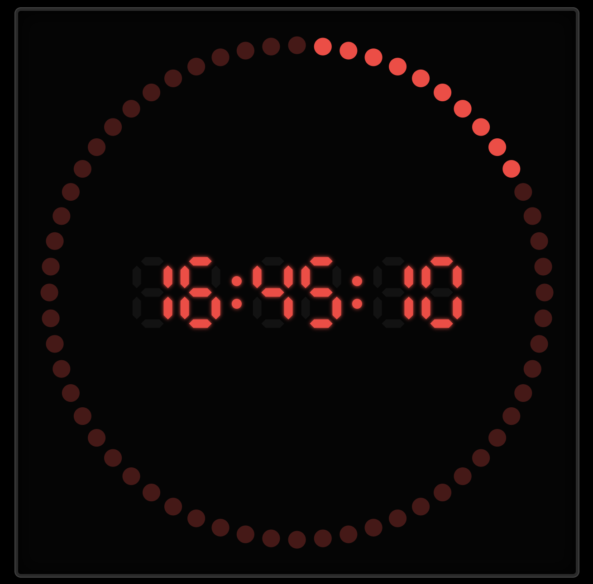
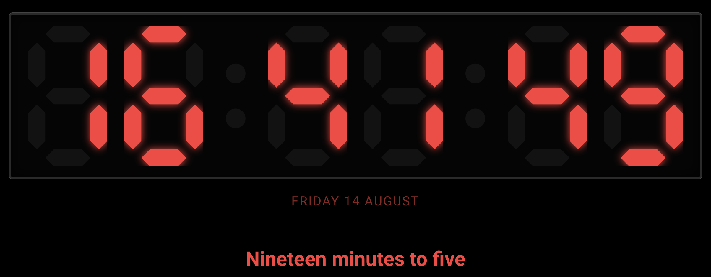
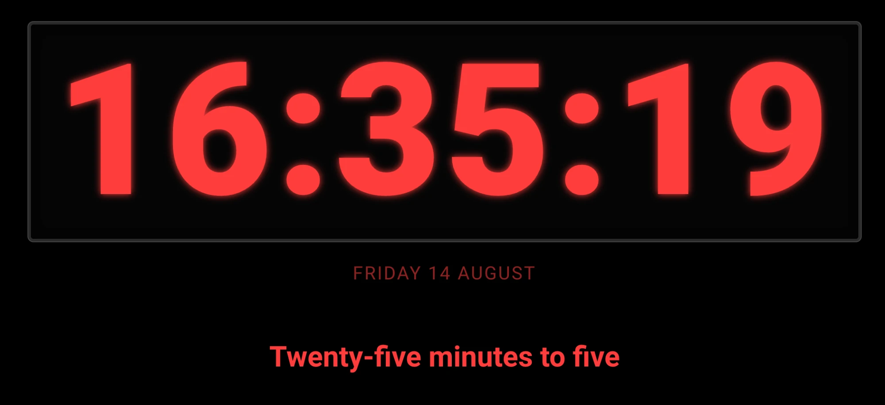

# Broadcast Clock Card

A broadcast-studio style on-air clock for Home Assistant Lovelace dashboards — Master Clock (studio analog), LED Ring (60-dot second ring with a digital or segment-LED readout), or plain Text — with an optional row of configurable status bars (recording / on-air / live indicators, single-colour or multi-state).

## Screenshots

*(a few still pending — placeholders below will be filled in. The Master Clock shot also shows the single-colour status bars alongside it.)*

| Master Clock (+ status bars) | LED Ring — glowing | LED Ring — bulb |
|---|---|---|
|  |  |  |

| LED Ring — flat | Text — segment font | Text — normal font |
|---|---|---|
|  |  |  |

| Status bars — single-colour | Status bars — multi-state |
|---|---|
|  |  |

## Installation

### HACS

Add this repository as a custom repository in HACS (category: Dashboard), then install "Broadcast Clock Card".

### Manual

Copy `broadcast-clock-card.js` into `<config>/www/`, then add it as a Lovelace resource:

```yaml
url: /local/broadcast-clock-card.js
type: module
```

A visual editor is included — every option below is also configurable entirely from the Lovelace UI.

## Quick start

```yaml
type: custom:broadcast-clock-card
clock_type: led_ring
led_style: glowing
ring_color_mode: rainbow
bars:
  - label: ON AIR
    color: "#ff3b3b"
    entity: binary_sensor.on_air
```

```yaml
# Studio analog clock, smooth sweep second hand, no bars
type: custom:broadcast-clock-card
layout: clock_only
clock_type: master_clock
second_hand_style: smooth
```

```yaml
# Plain 7-segment digital readout, 12-hour time
type: custom:broadcast-clock-card
clock_type: text
text_font: segment
time_format: 12h
```

## Config reference

### Top level

| Option | Type | Default | Description |
|---|---|---|---|
| `layout` | string | `clock_bars` | Panel arrangement: `clock_bars`, `bars_clock`, `clock_only`, `bars_only`, `stacked` (clock above bars) |
| `clock_type` | string | `led_ring` | `master_clock`, `led_ring`, or `text` — see below for type-specific options |
| `size_percent` | number | `70` | Clock size as a percentage of the available card height/width, whichever is smaller (10-100) |
| `text_scale_percent` | number | `16` | Digital/segment text size as a percentage of the clock's own size (5-40) |
| `text_glow_percent` | number | `100` | Glow intensity (0-200) — drives the LED Ring/Text digit glow and the Master Clock's edge-lit ring glow. Does **not** affect the LED Ring's own dot glow (see `led_style`) |
| `show_case` | boolean | `true` | Show the dark bezel "case" housing around the clock face |
| `text_color` | string | `#ff3b3b` | Colour of digital/segment text, date, and spoken-time text |
| `show_date` | boolean | `true` | Show/hide the date line |
| `date_format` | string | `long` | `long` ("Friday, 14 August"), `long_year` (+ year), `short` ("14 Aug 2026"), `numeric` ("14/08/2026") |
| `date_font` | string | `default` | `default` or `mono` (monospace) |
| `show_spoken_time` | boolean | `true` | Show/hide the plain-English spoken time line (e.g. "Quarter past six") |
| `time_sync_entity` | string | *(none)* | Optional entity (e.g. a template sensor ticking every second) whose `last_updated` timestamp corrects the clock against server time instead of the browser/tablet's own clock. Corrections apply at most once a minute regardless of how often the entity itself updates |
| `bars` | list | 4 demo bars | Status bars — see [Status bars](#status-bars) |
| `bar_off_style` | string | `neutral` | Inactive single-colour bar background: `neutral` (fixed dark grey) or `tinted` (a darker shade of the bar's own on-colour) |
| `bar_off_brightness` | number | `15` | % of the on-colour's brightness kept for the off state when `bar_off_style: tinted` (5-40) |

### `clock_type: master_clock`

Studio analog clock face with hour/minute/second hands. No sub-styles beyond:

| Option | Type | Default | Description |
|---|---|---|---|
| `second_hand_style` | string | `tick` | `tick` (discrete per-second steps, optionally with overshoot bounce) or `smooth` (continuous sweep via `requestAnimationFrame`, always accurate — recomputed from real time every frame, never drifts) |
| `second_hand_bounce_deg` | number | `2` | Overshoot bounce in degrees when settling each tick (0-8). `tick` style only |
| `tick_travel_time` | string | `medium` | How long each tick's step takes: `short`, `medium`, `long`. `tick` style only |

### `clock_type: led_ring`

A 60-dot second ring wrapping a digital or segment-LED readout (the readout uses the shared "text style" options below).

| Option | Type | Default | Description |
|---|---|---|---|
| `ring_color_mode` | string | `rainbow` | `rainbow`, `sunset`, `ocean`, `neon` (multi-colour palettes), `solid` (uses `ring_color`), or `match_text` (follows `text_color`) |
| `ring_color` | string | `#ff3b3b` | Ring colour used when `ring_color_mode: solid` |
| `led_style` | string | `glowing` | `flat` (plain dot), `glowing` (soft drop-shadow glow on every lit dot), or `bulb` (glow + a glassy highlight circle per dot) |
| `emphasize_current_second` | boolean | `true` | Give the current-second dot a modest size bump. Independent of the glow — every lit dot glows regardless of this setting |
| `led_off_style` | string | `dull` | Unlit dots: `dull` (dim, still visible) or `blank` (fully invisible until lit) |
| `ring_countdown` | boolean | `false` | Invert which dots are lit — the ring starts each minute fully dark and fills up to fully lit by :59, instead of starting fully lit and emptying out |

### Shared text style (`led_ring`'s readout, and standalone `clock_type: text`)

| Option | Type | Default | Description |
|---|---|---|---|
| `text_font` | string | `normal` | `normal` (plain digits) or `segment` (true 7-segment LED digit rendering) |
| `show_seconds` | boolean | `true` | Show/hide the seconds |
| `seconds_placement` | string | `newline` | `inline` (same line as HH:MM), `newline` (own line, smaller), or `newline_large` (own line, full size) |
| `time_format` | string | `24h` | `24h` or `12h`. In `12h` + `segment` font, AM/PM shows as a 2-dot indicator (top lit = AM, bottom lit = PM) rather than text |

### Status bars

Each entry in `bars` is one status bar:

| Field | Type | Description |
|---|---|---|
| `label` | string | Bar text |
| `type` | string | `single` (default) or `multi` |
| `entity` | string | Entity to read (optional — omit for a bar with no live data) |
| `attribute` | string | Read this attribute instead of the entity's own state (optional) |

**`type: single`** (default) — the bar is on/off:

| Field | Type | Description |
|---|---|---|
| `color` | string | On-state colour |
| `on_values` | string | Comma-separated values that count as "on" (optional — defaults to `on`/`true`/`home`/`open`) |

**`type: multi`** — the bar always shows a colour matching the entity's current value, never an on/off state:

| Field | Type | Description |
|---|---|---|
| `value_colors` | list | `{value, color}` pairs — value match is case-insensitive |
| `default_color` | string | Fallback colour for any value not in `value_colors` |

```yaml
bars:
  - label: ON AIR
    color: "#ff3b3b"
    entity: binary_sensor.on_air
  - label: PRESENCE
    type: multi
    entity: sensor.presence
    default_color: "#888888"
    value_colors:
      - value: home
        color: "#3bff6a"
      - value: away
        color: "#ff3b3b"
```

## Notes

- Configs saved with the older flat `clock_style` (`ring`/`led_ring`/`led_clock`/`digital_led`/`text`/`master_clock`) or `master_clock_case` keys are migrated transparently at read time — no manual changes needed for cards created before this option hierarchy existed.
- `time_sync_entity`, the smooth second hand, and the visibility/periodic resync (re-anchors the clock immediately when a hidden view/tab becomes visible again, plus a 60s backstop) all derive from the same corrected time source, so the whole card stays in sync with real time regardless of which display options are active.
